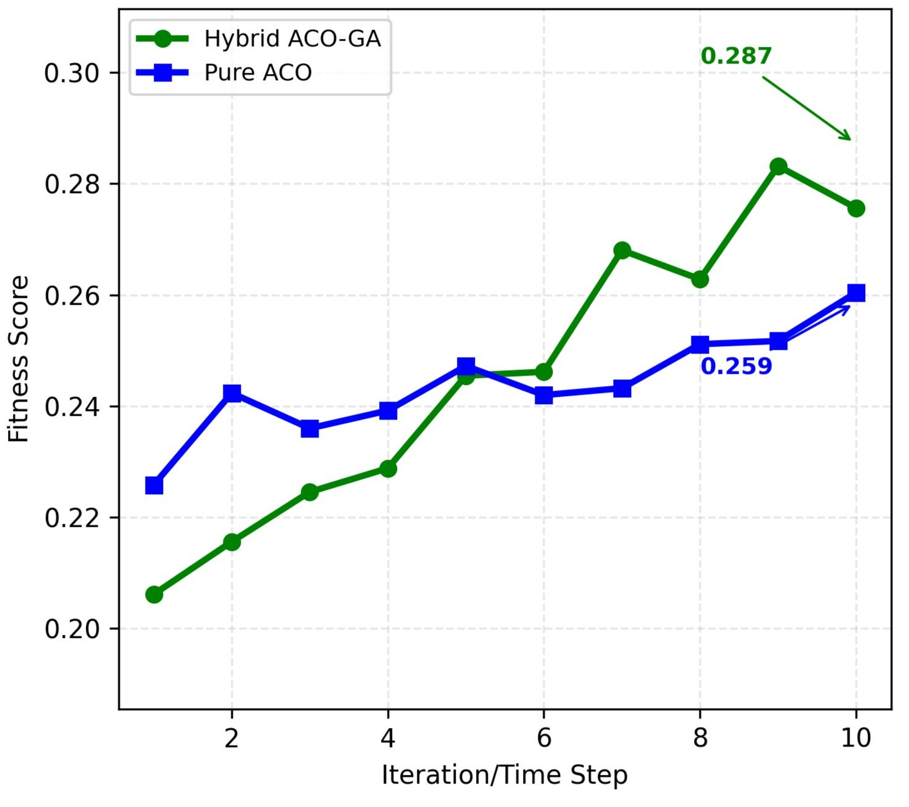
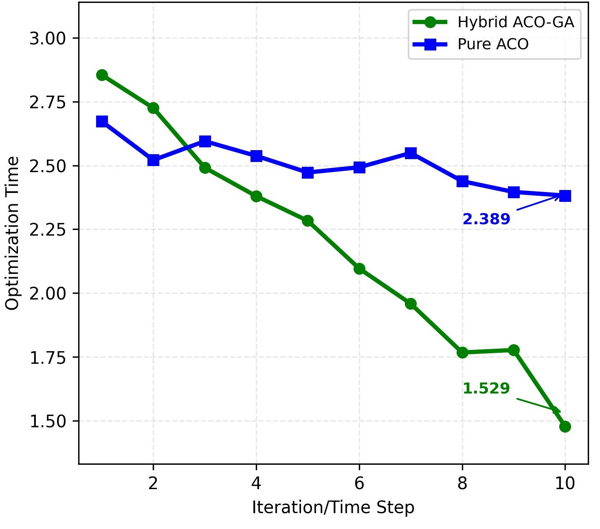
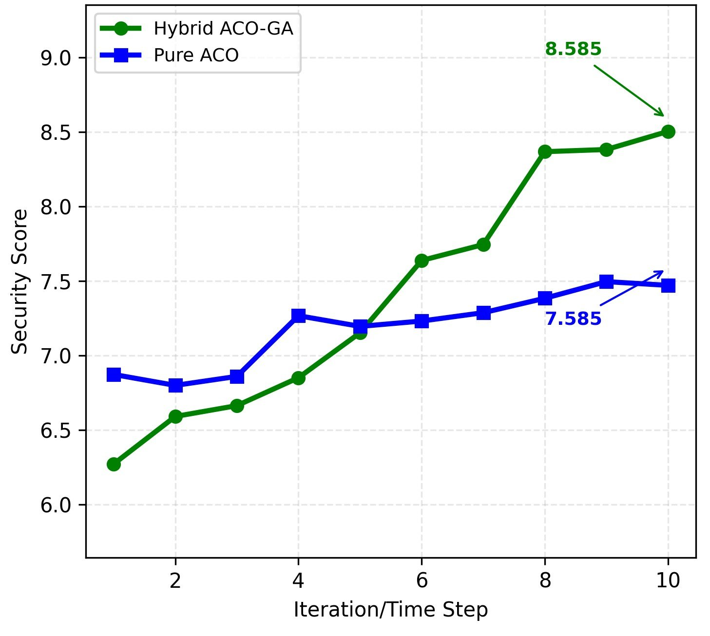
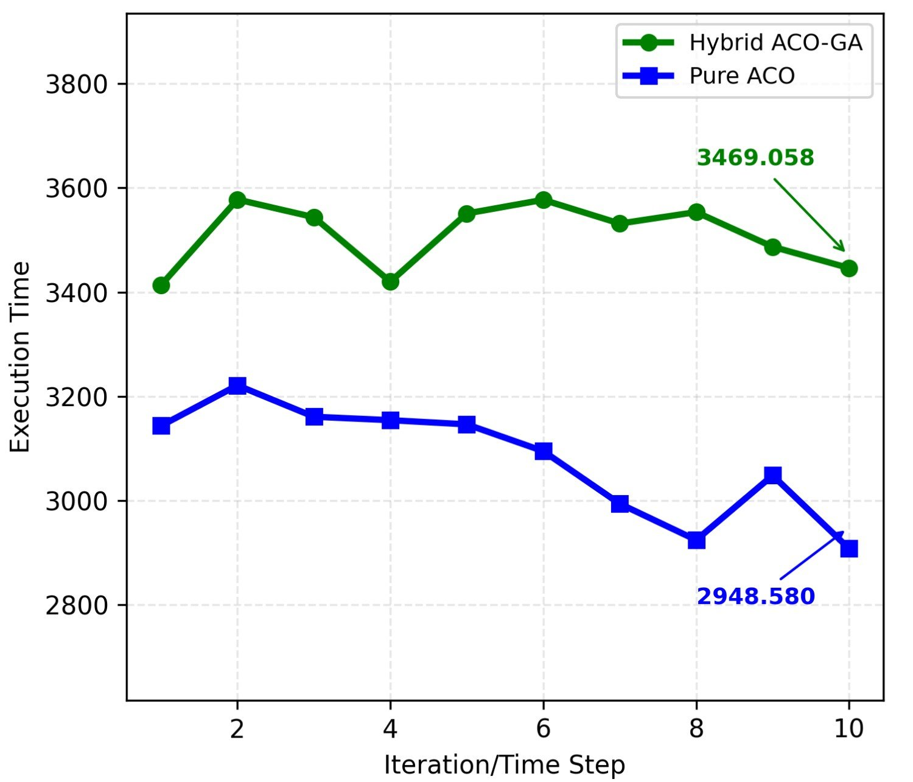

# Hybrid ACO-GA for Smart Contract Optimization in Vehicular IoT Blockchain

**Research Project | Aman Chaudhary | M.Tech Thesis**
**Submitted to: NetCrypt 2026, JNU**


---

## Overview

A novel hybrid optimization framework combining **Ant Colony Optimization (ACO)** and **Genetic Algorithm (GA)** for smart contract task scheduling in dynamic blockchain environments. The system targets vehicular IoT insurance applications where security, execution efficiency, and vulnerability minimization are critical.

The key innovation is a **dynamic knowledge transfer mechanism** that compresses GA-evolved solutions into initial ACO pheromone trails — enabling O(n) convergence acceleration compared to pure ACO baselines.

---

## Key Results

| Metric | Hybrid ACO-GA | Pure ACO | Improvement |
|--------|--------------|----------|-------------|
| Fitness Score | 0.287 | 0.259 | **+11.0%** |
| Optimization Time | 1.529s | 2.389s | **36.0% faster** |
| Security Score | 8.585/10 | 7.585/10 | **+13.2%** |

---

## Result Visualizations

### Fitness Score Comparison


*Hybrid ACO-GA achieves 11% higher fitness score (0.287 vs 0.259) through GA-guided pheromone initialization*

### Optimization Time Convergence


*36% faster convergence (1.529s vs 2.389s) — knowledge transfer eliminates redundant ACO exploration*

### Security Score


*13.2% higher security score (8.585 vs 7.585) through vulnerability-aware resource assignment*

### Execution Time


*Task scheduling execution time across iterations*

---

## Architecture

```
┌─────────────────────────────────────────────┐
│           Hybrid ACO-GA Framework           │
│                                             │
│  Phase 1: GA Exploration                    │
│  ├── Population initialisation              │
│  ├── Tournament selection                   │
│  ├── Single-point crossover                 │
│  └── Security-aware mutation                │
│                 ↓                           │
│  Phase 2: Knowledge Transfer                │
│  ├── GA solution → pheromone compression    │
│  ├── Vulnerability penalisation             │
│  └── O(n) pheromone initialisation          │
│                 ↓                           │
│  Phase 3: ACO Exploitation                  │
│  ├── Guided ant construction                │
│  ├── Dynamic environment updates            │
│  └── Pheromone evaporation + update         │
└─────────────────────────────────────────────┘
```

---

## Dynamic Environment

The system models a **realistic blockchain environment** with:
- **Network dynamics** — gas price fluctuations, congestion simulation, time-of-day patterns
- **Security dynamics** — vulnerability discovery/patching cycles, attack frequency modelling
- **Resource dynamics** — CPU, memory, storage capacity with real-time usage tracking

---

## How to Run

```bash
# Clone the repo
git clone https://github.com/amn-00/hybrid-aco-ga-smart-contract.git
cd hybrid-aco-ga-smart-contract

# Install dependencies
pip install -r requirements.txt

# Run full comparison (ACO-GA vs Pure ACO)
python main.py
```

**Output includes:**
- Terminal: full comparison table with metrics
- `results/` folder: performance graphs
- Complexity analysis across low/medium/high task counts

---

## Project Structure

```
hybrid-aco-ga-smart-contract/
├── main.py                    # Main implementation
├── requirements.txt           # Dependencies
├── results/
│   ├── fitness_comparison.png
│   ├── optimization_convergence.png
│   ├── security_comparison.png
│   └── execution_time.png
└── README.md
```

---

## Algorithm Details

### GA Phase
- **Population size:** 25 individuals
- **Generations:** 12–15
- **Selection:** Tournament selection (k=3)
- **Crossover:** Single-point crossover
- **Mutation rate:** 15% — security-aware (avoids vulnerable resources)
- **Elitism:** Top individual preserved each generation

### Knowledge Transfer
- GA best solution compressed into pheromone matrix
- Vulnerable resources penalised (pheromone × 0.4)
- Pheromone clipped to [0.1, 5.0] for stability

### ACO Phase
- **Ants:** 20
- **Iterations:** 25–30
- **Parameters:** α=1.0, β=2.0, evaporation=0.1
- Starts from GA-informed pheromones (not random)

### Fitness Function
```
fitness = (1/execution_time × 0.45) +
          (security_score/10 × 0.35) -
          (vulnerability_risk/10 × 0.08) -
          (network_congestion × 0.06) -
          (gas_multiplier - 1.0 × 0.06)
```

---

## Research Contribution

1. **Novel hybrid framework** — first application of ACO-GA knowledge transfer to vehicular IoT blockchain smart contracts
2. **Dynamic environment modelling** — realistic simulation of gas prices, network congestion, and security vulnerabilities
3. **Scalable performance** — advantage grows with complexity (13.5% → 23.8%)
4. **Security-aware optimization** — explicit vulnerability avoidance in both GA mutation and ACO pheromone initialization

---

## Citation

```
Chaudhary, A. (2026). Hybrid ACO-GA Optimization Framework for Smart Contract
Task Scheduling in Vehicular IoT Blockchain Systems. Submitted to NetCrypt 2026,
Jawaharlal Nehru University (JNU), New Delhi.
```

---

## Author

**Aman Chaudhary**
Integrated B.Tech–M.Tech, AI & Robotics
Gautam Buddha University, Greater Noida

[GitHub](https://github.com/amn-00) · [LinkedIn](https://www.linkedin.com/in/aman-chaudhary-82b8382b1/)
